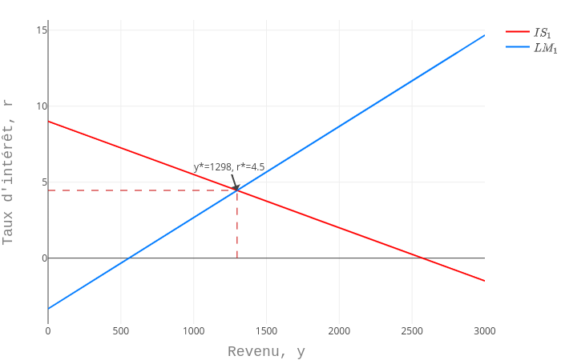
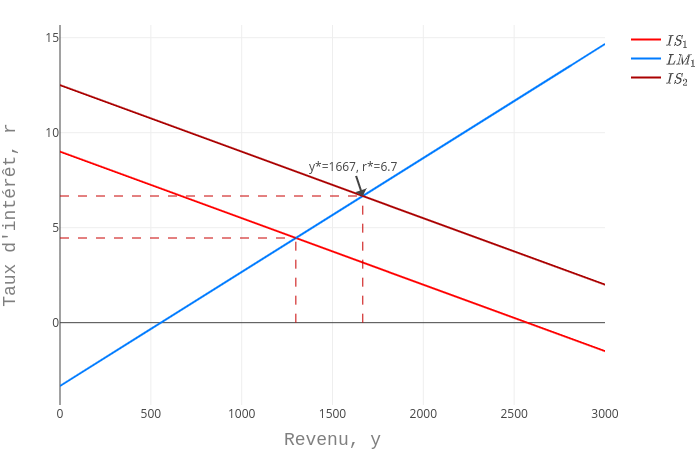
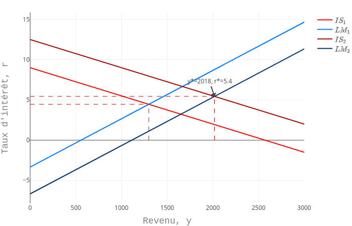

# Macroéconomie monétaire

Les applications dans ce repository sont utilisées pour le cours de macroéconomie monétaire de L2 à l'Université Lumière Lyon 2. Elles peuvent être réutilisées en citant leur origine. Leur contenu n'entend pas refléter une position de l'Université.

Quelques exemples de graphiques à partir de l'application ISLM_equilibrium

